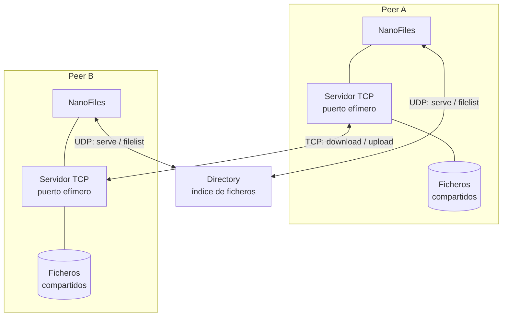
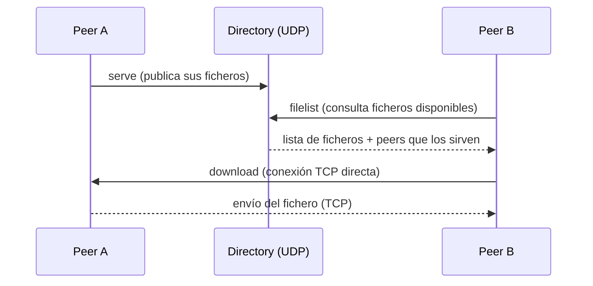

# NanoFiles


NanoFiles es una aplicación de compartición de ficheros **peer-to-peer** desarrollada en la asignatura *Redes de Comunicaciones*. El sistema combina un **servidor de Directorio** centralizado, que indexa qué ficheros ofrece cada peer, con transferencias de ficheros **directas entre peers** por TCP.

> Autoría: [Arturo Trinidad Hoyos](https://github.com/arthoyos) e [Ibrahim Cherif Barry](https://github.com/ibracb) · Grado en Ingeniería Informática · Universidad de Murcia · Curso 2024/2025

## Arquitectura

El sistema tiene dos roles, cada uno de ellos con su propio ejecutable:

- **Directorio** (`es.um.redes.nanoFiles.application.Directory`): servidor central que escucha por **UDP**. Los peers se dan de alta ante él (`serve`), consultan qué ficheros están disponibles en la red (`filelist`) y reciben la lista de peers que pueden servir un fichero concreto.
- **NanoFiles** (`es.um.redes.nanoFiles.application.NanoFiles`): cliente que cada usuario ejecuta. Se comunica con el Directorio por UDP y, al mismo tiempo, levanta su propio **servidor TCP** para que otros peers puedan descargarle ficheros directamente (arquitectura tipo "servidor de directorio + intercambio P2P puro", similar a eDonkey/BitTorrent con tracker).



Flujo típico:



### Estructura del código fuente

```
src/es/um/redes/nanoFiles/
├── application/      Puntos de entrada: NanoFiles.java (cliente) y Directory.java (servidor)
├── logic/             Controladores: lógica de comunicación con el Directorio y entre peers
├── shell/              Intérprete de comandos interactivo (NFShell, NFCommands)
├── udp/                Protocolo NanoFiles ↔ Directorio (cliente, servidor y formato de mensajes)
├── tcp/                Protocolo peer-to-peer (cliente, servidor y formato de mensajes)
└── util/               Utilidades: base de datos de ficheros compartidos, cálculo de hashes, metadatos
```

## Requisitos

- Java 8 o superior (JRE/JDK).

## Compilación

Se compila con `javac` directamente desde la terminal:

```bash
mkdir -p bin
javac -d bin $(find src -name "*.java")
```

## Uso

### 1. Arrancar el Directorio

```bash
java -cp bin es.um.redes.nanoFiles.application.Directory
```

Opcionalmente se puede simular pérdida/corrupción de datagramas UDP para probar la robustez del protocolo:

```bash
java -cp bin es.um.redes.nanoFiles.application.Directory -loss 0.1   # 10% de probabilidad de corrupción
```

### 2. Arrancar uno o varios clientes NanoFiles

Cada cliente puede indicar opcionalmente su carpeta compartida (por defecto, `nf-shared`):

```bash
java -cp bin es.um.redes.nanoFiles.application.NanoFiles [<carpeta_compartida>]
```

Esto abre un shell interactivo con los siguientes comandos:

| Comando | Descripción |
|---|---|
| `ping` | Comprueba que el Directorio está accesible y es compatible |
| `filelist` | Muestra la lista de ficheros indexados en el Directorio |
| `myfiles` | Muestra los ficheros de tu carpeta local compartida |
| `serve` | Levanta tu servidor de ficheros TCP y publica tus ficheros en el Directorio |
| `download` | Descarga un fichero de los peers que lo tengan disponible |
| `upload` | Sube un fichero a un peer servidor |
| `help` | Muestra la ayuda de comandos |
| `quit` | Sale de la aplicación |

### Ejemplo de flujo típico

1. Arrancar `java -cp bin es.um.redes.nanoFiles.application.Directory` en una máquina (o `localhost` para pruebas).
2. En cada peer, ejecutar `java -cp bin es.um.redes.nanoFiles.application.NanoFiles` y usar `serve` para publicar los ficheros de su carpeta compartida.
3. Desde otro peer, usar `filelist` para ver qué hay disponible y `download <fichero>` para descargarlo directamente del peer que lo sirve.

## Protocolo de comunicación

- **Protocolo NanoFiles ↔ Directorio (UDP)**: mensajes en texto plano con esquema `campo:valor` (p. ej. `operation:ping\n\n`), con un autómata de estados en cliente y servidor.
- **Protocolo peer-to-peer (TCP)**: formato de mensajes y autómata propios para la descarga/subida directa de ficheros entre peers.
- **Mejora implementada**: uso de **puerto efímero** en el comando `serve`, de modo que el servidor de ficheros de cada peer no depende de un puerto fijo (10000/TCP) sino que puede usar cualquier puerto disponible.

## Carpetas de datos de prueba

`nf-shared/` y `nf-shared2/` contienen ficheros de ejemplo usados para probar la compartición y descarga entre dos peers distintos durante el desarrollo; no forman parte del código de la aplicación.
